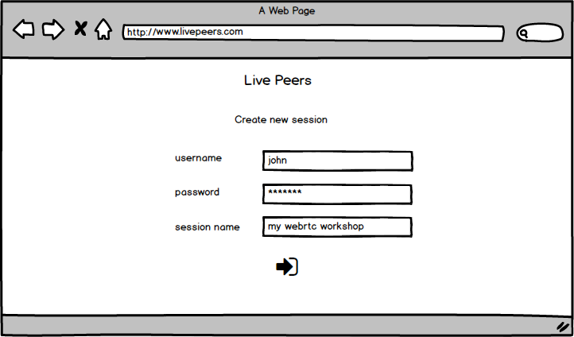
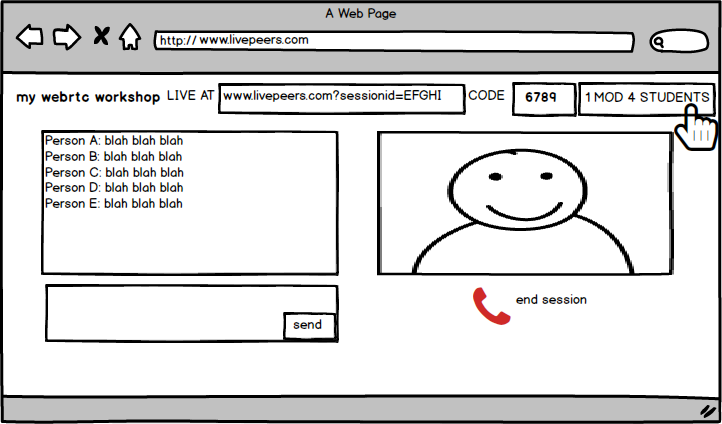
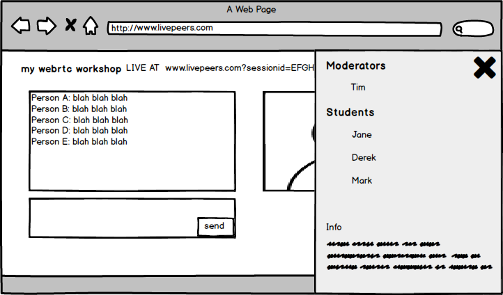
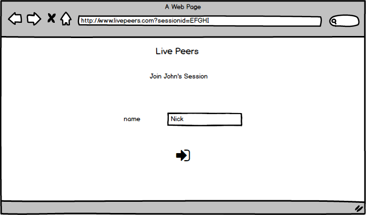
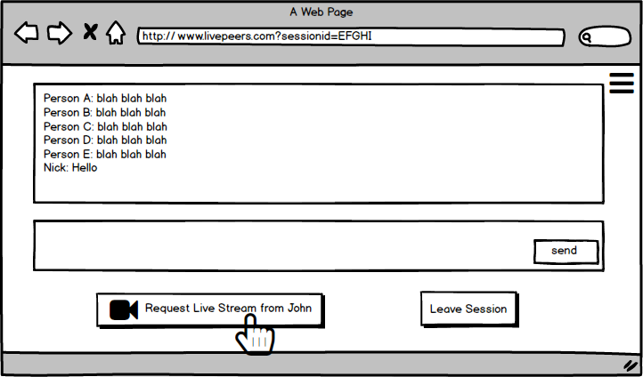
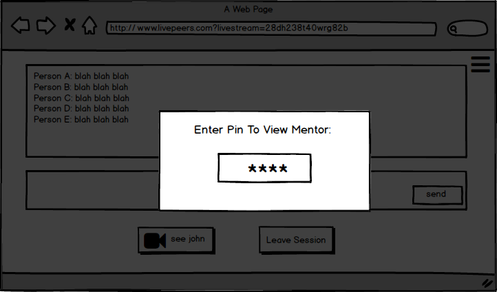
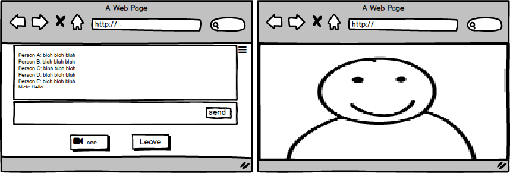

# SPRINT 1

## User journeys

**As a** mentor  
**I would like to** share my content (across campuses)  
**So that** paricipation is not limited by location

**As a** moderator  
**I would like to** access content and be able to share it  
**So that** those in my location can participate

**As a** student  
**I would like to** access remote content and share my own messages  
**So that** I can actively participate in the learning experience

For breakdown into user stories, see github issues.

### Stretch goals
**Problem:** Participation  

**Feature 1:** Text service for participants
  + Write a piece of text that everyone else can see
  + Names being attached to messages

**Feature 1:** Authentication  

Determine identity of:
  + Presenter
  + Participant(s)

## Wireframes
#### Mentor journey

Create page  
  

Chat/AV view  
  

Chat/AV view - with pop out to show how many students and moderators are online
  

#### Student journey
Join Page  
  

Chat View  
  

#### Moderator journey
(Starts as a student - see [student journey](#student-journey))  

Chat View - with PIN modal  

New window - full screen AV stream  

## Permissions Model

Roles & Permissions      |   Mentor   |   Moderator   |   Student   |
------------|--------------|--------------|-----------|
**Send AV**  | Y | N | N     
**Receive AV**  | N | Y | N  
**Text**  | Y | Y | Y      
